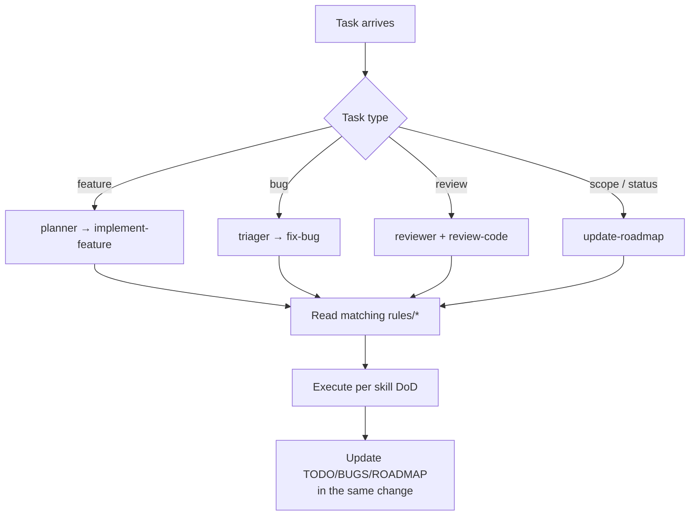

# .agents/INDEX.md — Gateway

Read `AGENTS.md` first. This index routes you to the right detail.

## 🗺️ Map

| Area | Files | Use when |
| --- | --- | --- |
| Root entry | `AGENTS.md` | Starting anything; condensed conventions + decision log |
| Product direction | `ROADMAP.md` | Asking "what/why next" |
| Task ledger | `TODO.md` | Asking "what do I do now", updating status |
| Issue ledger | `BUGS.md` | Recording/triaging defects and known quirks |
| Standing rules | `.agents/rules/*` | Writing or reviewing *any* code |
| Roles | `.agents/agents/*` | Acting as planner / engineer / reviewer / triager |
| Workflows | `.agents/skills/*` | Executing a multi-step routine end-to-end |
| Templates | `.agents/templates/*` | Creating bug/feature/PR/todo documents |
| Detail files | `.agents/tracking/*` | Deep-diving a single bug or big task |

## ⚠️ Standing rules (read before code)

- `rules/general.md` — universally true conventions (naming, docs, scope, etiquette)
- `rules/project-identity.md` — the product is **NH Desktop**; folder name ≠ project name, ever
- `rules/frontend.md` — Svelte 5, SvelteKit SPA, TS, CSS-token styling
- `rules/backend.md` — Rust, Tauri commands, reqwest, error handling
- `rules/security.md` — secrets, CSP, remote-image trust, API etiquette/rate limits
- `rules/testing.md` — what "done & verified" means here
- `rules/git-workflow.md` — branches, commits, PRs, headless-shell rules
- `rules/context-management.md` — DCP/compress tool contract, size limits, when/what to compress
- `rules/docs-format.md` — emoji + mermaid readability-first conventions (user has poor eyesight; diagrams must stay legible)

## 👥 Roles

- `agents/planner.md` — decomposes ROADMAP into TODO items; owns scope
- `agents/backend-engineer.md` — Rust/Tauri work
- `agents/frontend-engineer.md` — Svelte/TS/CSS work
- `agents/reviewer.md` — pre-commit review pass per `skills/review-code.md`
- `agents/triager.md` — bugs: reproduce, classify, route, and record in `BUGS.md`

## 🛠️ Skills (workflows)

- `skills/implement-feature.md` — end-to-end feature lifecycle
- `skills/fix-bug.md` — end-to-end bug lifecycle
- `skills/review-code.md` — checklist-driven review
- `skills/update-roadmap.md` — keeping ROADMAP/TODO/BUGS truthful
- `skills/manage-context.md` — run a DCP compression pass when nudged or saturated
- `skills/add-diagrams.md` — add a mermaid diagram that renders on GitHub and stays legible

## 🔄 Default operating loop

1. Identify task type (feature / bug / plan / review) and read the matching skill.
2. Read the relevant rules. Read the relevant existing code (follow its patterns).
3. Implement. Run the checks named in `AGENTS.md` *for the changed side*.
4. Update `TODO.md`/`BUGS.md`/`ROADMAP.md` in the same change if scope or status moved.
5. Report concisely: what changed, what was verified, what's left.