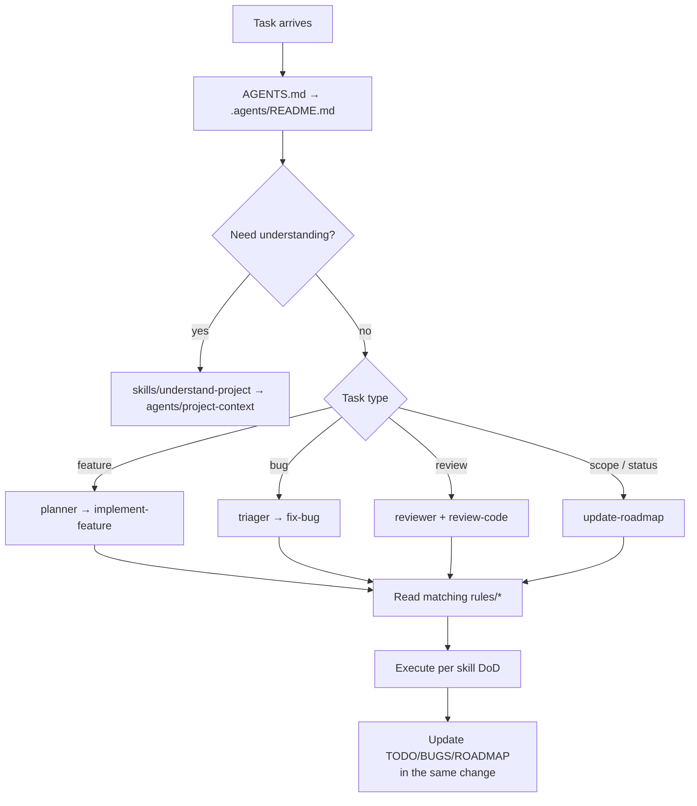

# .agents/ — Agent Ecosystem (Gateway)

Read `AGENTS.md` first, then return here — this is the **single gateway** into the agent
ecosystem. Everything an AI agent needs to *understand* this project (functionality,
standards, requirements) and *execute* work routes through here. There is no `INDEX.md`;
`README.md` is the index so GitHub renders it online.

> **First time in this repo?** Start with `skills/understand-project.md` — it's the ramp-up
> routine that compresses "what does this project do, how is it built, what are the rules"
> into a minimal reading plan.

## 🏛️ Principles

1. **One brain, one doctrine.** No parallel, conflicting rule sets. Rules live here and
   only here (plus the condensed summary in root `AGENTS.md`).
2. **Entry points are short, depth is earned.** `AGENTS.md` summarizes; rules are reserved
   for where nuance actually matters.
3. **Living docs.** `TODO.md`, `BUGS.md`, `ROADMAP.md` and this tree are updated in the
   same change that changes behavior — never afterwards, never silently.
4. **Agents never mutate policy.** Rules/agents/skills are changed only when the *user*
   asks for it; implementer agents follow them as written.
5. **No per-tool config.** No `.opencode/`, no `CLAUDE.md`, no per-runtime rule files.
   Root `AGENTS.md` is the cross-agent entry point; everything else lives under `.agents/`.
6. **Index files are `README.md`.** Every folder's index is a `README.md` so it renders
   online (GitHub). See `rules/agent-ecosystem.md`.

## 🗺️ Map



## 🏗️ Layout

```
.agents/
  README.md            # this file — gateway / routing table
  rules/               # standing conventions (read before writing code)
    general.md         # universal coding + repo etiquette
    project-identity.md# the product is NH Desktop; folder name ≠ project name, ever
    requirements.md    # how functionality/standards/requirements are sourced & recorded
    agent-ecosystem.md # how agents are structured, shared, and extended; README.md-index rule
    frontend.md        # Svelte/TS/CSS conventions
    backend.md         # Rust/Tauri conventions
    security.md        # secret handling, API respect, CSP
    testing.md         # how to verify work
    git-workflow.md    # commits, branches, PRs, headless-shell rules
    context-management.md # DCP/compress tool contract + size limits
    docs-format.md     # emoji + mermaid legibility conventions (poor eyesight)
  agents/              # role definitions — {primary-agent}/{sub-agent}/README.md
    project-context/   # PRIMARY: owns the "what/why/how it's built" knowledge
      README.md
      requirements/    # SUB: turn asks into traced requirement docs
      standards/       # SUB: owns decision log + rules coherence
    planner/           # PRIMARY: roadmaps & decomposition
      README.md
      roadmap/         # SUB: decompose ROADMAP → TODO items
    engineer/          # PRIMARY: implementation coordinator
      README.md
      backend/         # SUB: Rust/Tauri
      frontend/        # SUB: Svelte/TS/CSS
    reviewer/          # PRIMARY: verification gate
      README.md
      security/        # SUB: security-focused review pass
    triager/           # PRIMARY: bug intake & classification
      README.md
      reproducer/      # SUB: deep reproduction & regression proof
  skills/              # repeatable workflows (shared, never duplicated)
    understand-project.md
    implement-feature.md
    fix-bug.md
    review-code.md
    update-roadmap.md
    manage-context.md
    add-diagrams.md
    add-agent.md
  templates/           # fill-in-the-blank docs
    agent.md
    requirement.md
    feature.md
    bug.md
    pr.md
    todo.md
  tracking/            # optional detail files, one per item
    bugs/
    todos/
```

## ⚠️ Standing rules (read before code)

- `rules/general.md` — universally true conventions (naming, docs, scope, etiquette)
- `rules/project-identity.md` — the product is **NH Desktop**; folder name ≠ project name, ever
- `rules/requirements.md` — where functionality/standards/requirements come from and how to record them
- `rules/agent-ecosystem.md` — structure, sharing, and extension of this `.agents/` tree
- `rules/frontend.md` — Svelte 5, SvelteKit SPA, TS, CSS-token styling
- `rules/backend.md` — Rust, Tauri commands, reqwest, error handling
- `rules/security.md` — secrets, CSP, remote-image trust, API etiquette/rate limits
- `rules/testing.md` — what "done & verified" means here
- `rules/git-workflow.md` — branches, commits, PRs, headless-shell rules
- `rules/context-management.md` — DCP/compress tool contract, size limits
- `rules/docs-format.md` — emoji + mermaid legibility (user has poor eyesight)

## 👥 Agents (roles)

Primary agents are folders under `agents/`; each has a `README.md` (its identity) plus
sub-agent folders. Full definitions live in those files — summaries here keep the gateway
short.

| Primary | Domain | Sub-agents |
| --- | --- | --- |
| `project-context` | Understand & communicate what the app **is**, **why**, and **how** it's built | `requirements`, `standards` |
| `planner` | Roadmaps, scope, milestone honesty | `roadmap` |
| `engineer` | Delivery: backend + frontend implementation | `backend`, `frontend` |
| `reviewer` | Verification gate before "done" | `security` |
| `triager` | Bug intake, classification, routing | `reproducer` |

## 🛠️ Skills (workflows)

- `skills/understand-project.md` — ramp up fast: functionality, standards, requirements
- `skills/implement-feature.md` — end-to-end feature lifecycle
- `skills/fix-bug.md` — end-to-end bug lifecycle
- `skills/review-code.md` — checklist-driven review
- `skills/update-roadmap.md` — keeping ROADMAP/TODO/BUGS truthful
- `skills/manage-context.md` — run a DCP compression pass when nudged or saturated
- `skills/add-diagrams.md` — add a mermaid diagram that renders on GitHub and stays legible
- `skills/add-agent.md` — add or restructure a primary/sub agent without duplication

## 🔍 Routing (who reads what)

| Task | Read first |
| --- | --- |
| First task in this repo | `AGENTS.md` → this README → `skills/understand-project.md` |
| Understand functionality/standards/requirements | `agents/project-context/README.md` + `rules/requirements.md` |
| Implement a feature | `agents/planner/README.md` + `skills/implement-feature.md` |
| Fix a bug | `agents/triager/README.md` + `skills/fix-bug.md` + `BUGS.md` |
| Plan/prioritize | `ROADMAP.md` + `agents/planner/README.md` + `skills/update-roadmap.md` |
| Review changes | `agents/reviewer/README.md` + `skills/review-code.md` + `TODO.md` |
| New work item | `templates/todo.md`/`templates/feature.md` → append to `TODO.md` |
| New requirement | `agents/project-context/requirements/` + `templates/requirement.md` |
| New/edited agent | `skills/add-agent.md` + `templates/agent.md` |
| Context saturated (DCP reminder) | `rules/context-management.md` + `skills/manage-context.md` |

## 🔄 Default operating loop

1. Ramp up with `skills/understand-project.md` when context is thin (first task, or a new domain).
2. Identify task type (feature / bug / plan / review) and read the matching skill.
3. Read the relevant rules. Read the relevant existing code (follow its patterns).
4. Implement. Run the checks named in `AGENTS.md` *for the changed side*.
5. Update `TODO.md`/`BUGS.md`/`ROADMAP.md` in the same change if scope or status moved.
6. Report concisely: what changed, what was verified, what's left.

## 🛠️ Keeping this ecosystem healthy

- Format is GitHub-flavored Markdown; every folder index is a `README.md`.
- Keep files dense and scannable: tables before prose, headers before paragraphs.
- A convention belongs in a **rule** only when violating it has a real cost. YAGNI applies.
- When a decision is settled at a project level, add one line to the **Decision log** in
  root `AGENTS.md` and, if it bends a rule, update the rule. Owned by
  `agents/project-context/standards/`.
- Anything the tooling needs to *do* repeatedly belongs in `skills/`, not in `rules/`.