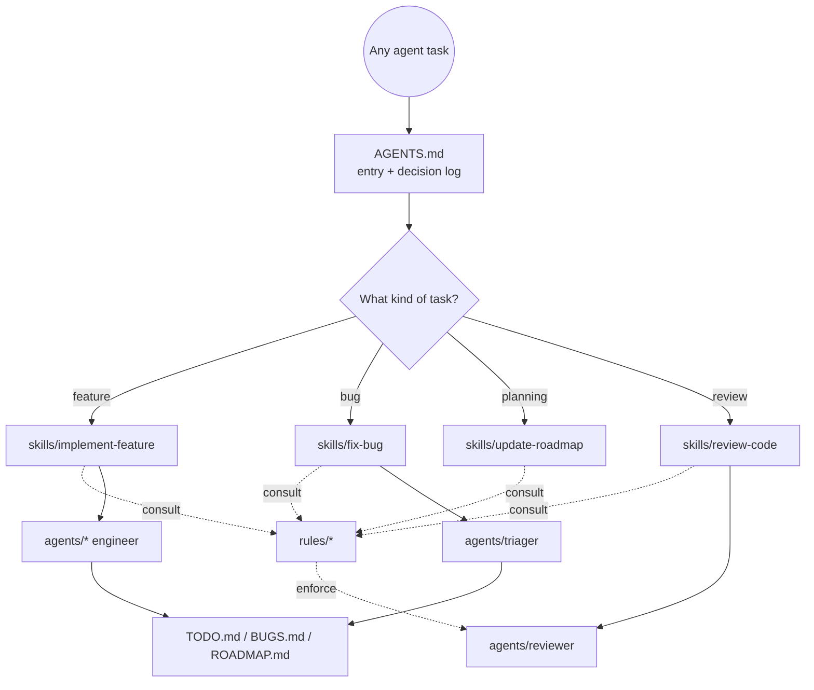

# .agents/ — Agent Ecosystem

This folder is the **single source of truth** for how AI agents operate in this
repository. It exists to be run-agnostic: whether the tool at hand is opencode (which
auto-loads root `AGENTS.md`), Claude Code/Cursor/Codex-like agents, or custom harnesses,
the same conventions and workflows apply. Root `AGENTS.md` is the entry point; everything
below it is reachable via `INDEX.md`.

## Principles

1. **One brain, one doctrine.** No parallel, conflicting rule sets. Rules live here and
   only here (plus the condensed summary in root `AGENTS.md`).
2. **Entry points are short, depth is earned.** `AGENTS.md` summarizes; rules are reserved
   for where nuance actually matters.
3. **Living docs.** `TODO.md`, `BUGS.md`, `ROADMAP.md` and this tree are updated in the
   same change that changes behavior — never afterwards, never silently.
4. **Agents never mutate policy.** Rules/agents/skills are changed only when the *user*
   asks for it; implementer agents follow them as written.
5. **No per-tool config.** No `.opencode/`, no `CLAUDE.md`, no per-runtime rule files.
   Root `AGENTS.md` is the cross-agent entry point (read by opencode, Claude Code, Cursor,
   Codex, Windsurf, and others); everything else lives under `.agents/`.

## Layout

```
.agents/
  README.md            # this file
  INDEX.md             # gateway / routing table
  rules/               # standing conventions (read before writing code)
    general.md         # universal coding + repo etiquette
    project-identity.md # the product is nhentai; folder name ≠ project name, ever
    frontend.md        # Svelte/TS/CSS conventions
    backend.md         # Rust/Tauri conventions
    security.md        # secret handling, API respect, CSP
    testing.md         # how to verify work
    git-workflow.md    # commits, branches, PRs, headless-shell rules
    context-management.md # DCP/compress tool contract + size limits
  agents/              # role definitions
    planner.md
    backend-engineer.md
    frontend-engineer.md
    reviewer.md
    triager.md
  skills/              # repeatable workflows
    implement-feature.md
    fix-bug.md
    review-code.md
    update-roadmap.md
    manage-context.md   # run a DCP compression pass
  templates/           # fill-in-the-blank docs
    bug.md
    feature.md
    pr.md
    todo.md
  tracking/            # optional detail files, one per item
    bugs/
    todos/
```

## Ecosystem at a glance



## Routing (who reads what)

| Task | Read first |
| --- | --- |
| Any task | `AGENTS.md` → `rules/` that apply |
| Implement a feature | `agents/planner.md` + `skills/implement-feature.md` |
| Fix a bug | `agents/triager.md` + `skills/fix-bug.md` + `BUGS.md` |
| Plan/prioritize | `ROADMAP.md` + `agents/planner.md` + `skills/update-roadmap.md` |
| Review changes | `agents/reviewer.md` + `skills/review-code.md` + `TODO.md` |
| New work item | `templates/todo.md`/`templates/feature.md` → append to `TODO.md` |
| Sync with reference repo | lewdzone-launcher: pattern for installer, reference only, never product |
| Context saturated (DCP reminder) | `rules/context-management.md` + `skills/manage-context.md` |

## Keeping this ecosystem healthy

- Format is GitHub-flavored Markdown; frontmatter is optional and used only for agent
  definitions (see `agents/*.md`).
- Keep files dense and scannable: tables before prose, headers before paragraphs.
- A convention belongs in a **rule** only when violating it has a real cost. YAGNI applies.
- When a decision is settled at a project level, add one line to the **Decision log** in
  root `AGENTS.md` and, if it bends a rule, update the rule.
- Anything testing the agent ecosystem itself belongs in `skills/` (workflows the
  tooling uses), not in `rules/`.