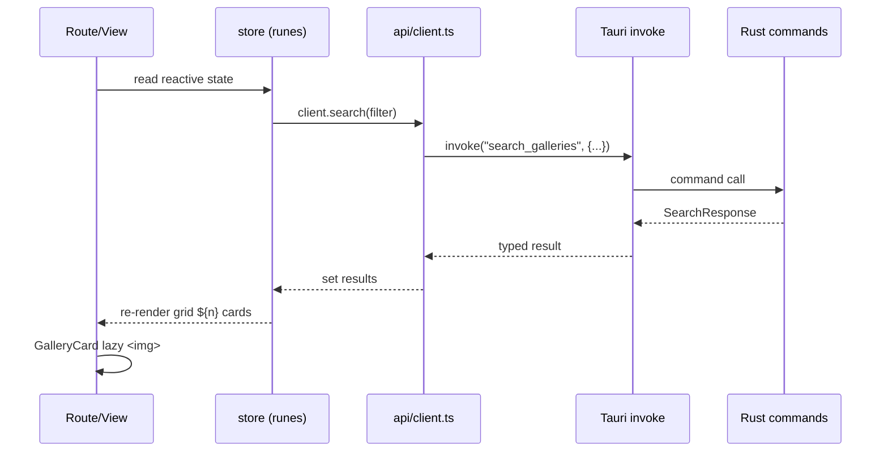
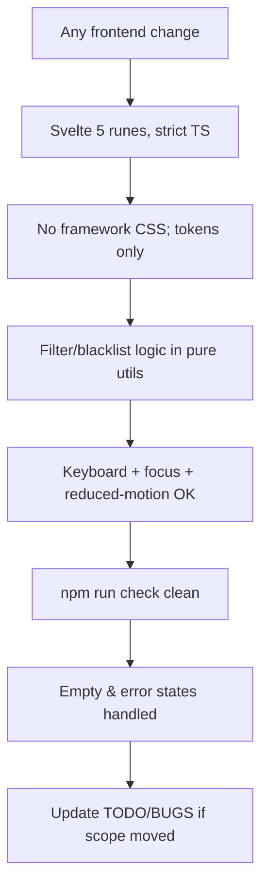

# Agent: Frontend Engineer

## Identity

```yaml
name: frontend-engineer
role: Svelte UI & client state
reads: rules/frontend.md, rules/security.md, rules/testing.md, rules/git-workflow.md, rules/general.md
writes: src/lib/**, src/routes/**
verifies: npm run check
```

## Responsibility

- Build the custom UI: views, gallery grid, filter/blacklist surfaces, reader, stores.
- Own the client-side contract in `src/lib/api/types.ts` + `client.ts` (typed `invoke`).
- Filter truth lives in `src/lib/util/` (query builder, blacklist matcher) — pure, tested.
- Apply the design tokens everywhere; accessibility = non-negotiable.

## Data flow (one view end-to-end)



## Frontend non-negotiables



## Notes

- Never fetch nhentai directly from the browser; never `{@html}` API data.
- Reuse existing components instead of drifting new variants (`GalleryCard` everywhere).
- Follow `rules/frontend.md`; when a component pattern repeats thrice, extract it.