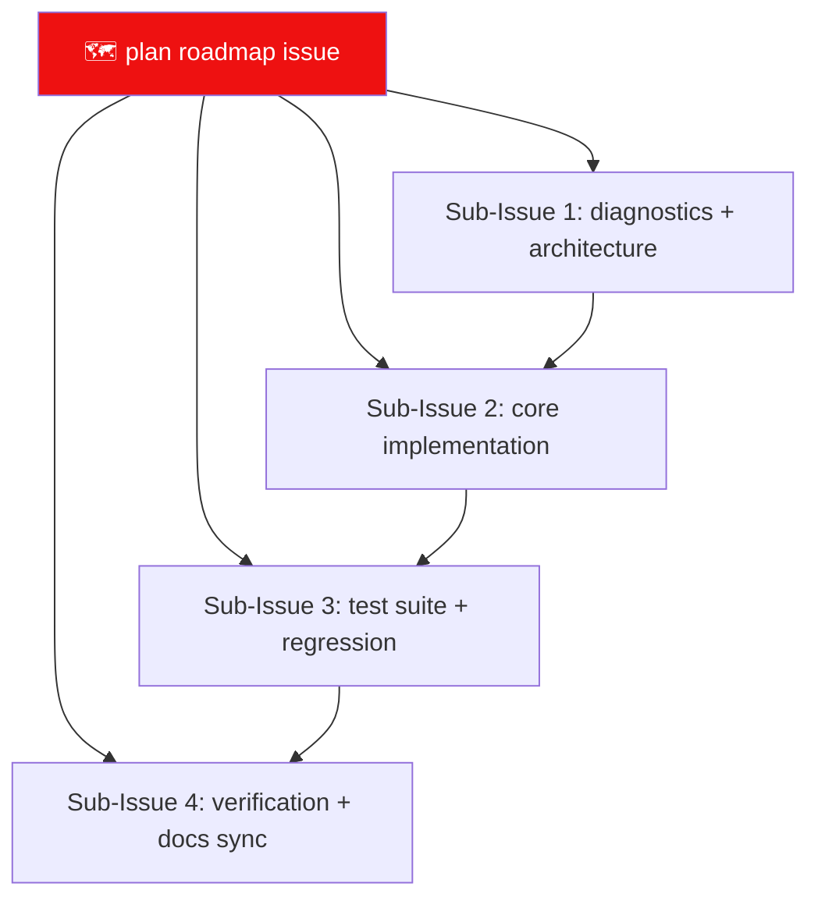

# Rule: Remote Issue Protocol

How NH Desktop plans, tracks, and merges work on GitHub — **roadmap-first,
edit-in-place, never sprawl.** Adapted from the lewdzone-launcher reference
repo's Rule 04 (same doctrine the user prefers for all projects).

## Principles

1. **Roadmap-first.** Every plan traces to `ROADMAP.md` (or a roadmap issue whose
   first post is the living roadmap, edited *in place* as work progresses). Never
   post new top-level issues for items already tracked upstream.
2. **One plan per issue.** Never fold separate plans into one issue.
3. **Issues before PRs.** Every PR mirrors an issue with `Part of #parent` /
   `Closes #sub-issue` (or a TODO/BUG id when the repo tracker is the source of
   truth).
4. **Commits follow the commit-message template**
   (`.agents/templates/commit-message.md`).
5. **Mermaid in every plan/bug issue.** ≥1 GitHub-compatible diagram, per
   `docs-format.md`.

## Issue title format

| Kind | Title pattern |
| --- | --- |
| Roadmap/plan | `🗺️ <general plan>` |
| Feature | `✨ <feature overview>` |
| Bug | `🐛 <problem summary>` |
| Sub-issue | `Sub-Issue N: <feature> (#parent)` |
| Discovery / side-change | `🔧 <plain description>` (linked to parent) |

## Lifecycle



Each sub-issue:

- **Sub-Issue 1** — diagnostics, architecture, design decisions.
- **Sub-Issue 2** — implementation (Rust commands/service, Svelte views, types).
- **Sub-Issue 3** — regression checks, unit tests, fixture verification.
- **Sub-Issue 4** — verification gate (`testing.md`), docs sync
  (`TODO.md`/`ROADMAP.md`/`CHANGELOG.md`), release prep.

Small tasks skip the full lifecycle and go straight to a `TODO.md` item; the
lifecycle is for plans, not chores.

## Body submission mechanics (non-interactive)

Agents run headless. Submit issue/PR/update bodies via `--body-file <utf8file>`,
never inline unicode/emoji:

```bash
gh issue edit <parent> --body-file roadmap.md
gh pr create --body-file pr-body.md
```

`gh` is required for all remote operations.

## Verify

- `gh issue view <id> -R HELIX-Origin/nhentai-desktop --json body -q .body` →
  first post still the roadmap; item still present after edits.
- Every PR body references at least one issue or tracker id (`Part of`, `Closes`,
  or `TODO-###`).