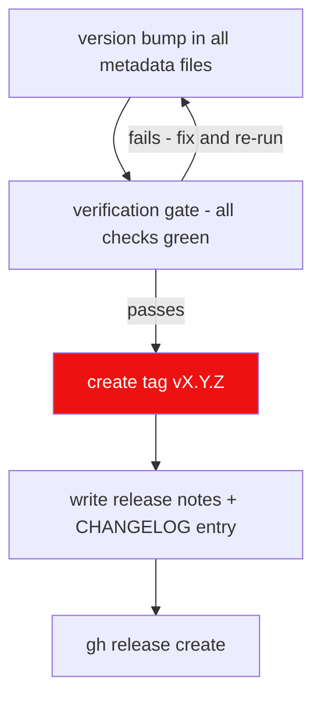

# Rule: Release Standards

Every NH Desktop release is SemVer-versioned, fully verified, tagged, and
published through GitHub CLI with structured release notes. Adapted from the
lewdzone-launcher reference repo's Rule 08.

## Versioning: SemVer `MAJOR.MINOR.PATCH`

| Segment | Bump when | Examples |
| --- | --- | --- |
| MAJOR | breaking API/contract/daemon-installer changes | `2.0.0` |
| MINOR | new compatible features | `2.3.0` |
| PATCH | compatible bug fixes | `2.3.1` |

## Release flow



## Mandatory steps

1. **Version sync.** `MAJOR.MINOR.PATCH` must be identical across every metadata
   file before tag/publish: `src-tauri/Cargo.toml`, `src-tauri/tauri.conf.json`,
   root `package.json`.
2. **Verification gate before tag/commit/publish** (per `testing.md`):
   - `cargo test` green + `cargo check` exit 0
   - `npm run check` (svelte-check) zero errors
   - `npm run build` green (frontend production build)
   - Installer smoke: ensure `npm run tauri build` produces the expected bundles
     (`NH Desktop-Setup-<version>-<platform>-<arch>` etc.) without panics across the command
     boundary.
3. **Tag format:** `vX.Y.Z` (e.g. `v1.4.2`), annotated, on the merge commit of
   the release branch.
4. **Release title:** `vX.Y.Z — <Key Feature>` (e.g.
   `v1.4.2 — unified installer + background service`).
5. **Release notes structure** — controlled by `.github/workflows/package.yml`
   (`name: 'NH Desktop ${{ github.ref_name }}'`), body links to CHANGELOG:
   - `✨ Highlights`
   - `🚀 Key Improvements & Features`
   - `🛡️ Security & Governance`
   - `📄 Changes & Commits` link + notable commits
   - `📦 Install & Upgrading` (Windows installer / macOS app / Linux packages)
   - `📜 Changelog` link to `CHANGELOG.md`
   Use the `.agents/templates/release-notes.md` and `.agents/templates/changelog.md`
   templates; they are authored from the same commit list.
6. **Publish via GitHub CLI, non-interactive, body from file:**
   ```bash
   gh release create vX.Y.Z \
     --title "vX.Y.Z — <Key Feature>" \
     --notes-file release-notes.md
   ```
   Tag push to `v*` triggers the packaging workflow, which attaches the built
   installers to the release (`softprops/action-gh-release`).
7. **Post-release:** update `ROADMAP.md` milestone status, close tracker items,
   mark docs/changelog done in the same commit.

## Pre-release (alpha/beta)

- Apply a pre-release suffix: `v2.0.0-alpha.1`, `v2.0.0-beta.2`.
- Use `--prerelease` flag on `gh release create`.
- Gate is identical; only the tag and flag differ.

## Failure modes

- Tag created without the verification gate passing → release is void; fix
  forward, do **not** delete/re-push tags.
- Version mismatch between metadata files → CI must fail.
- Release notes referencing an unmerged/un-shipped sub-issue → block.
- Uninstaller/installer smoke not passing on the release build → block.