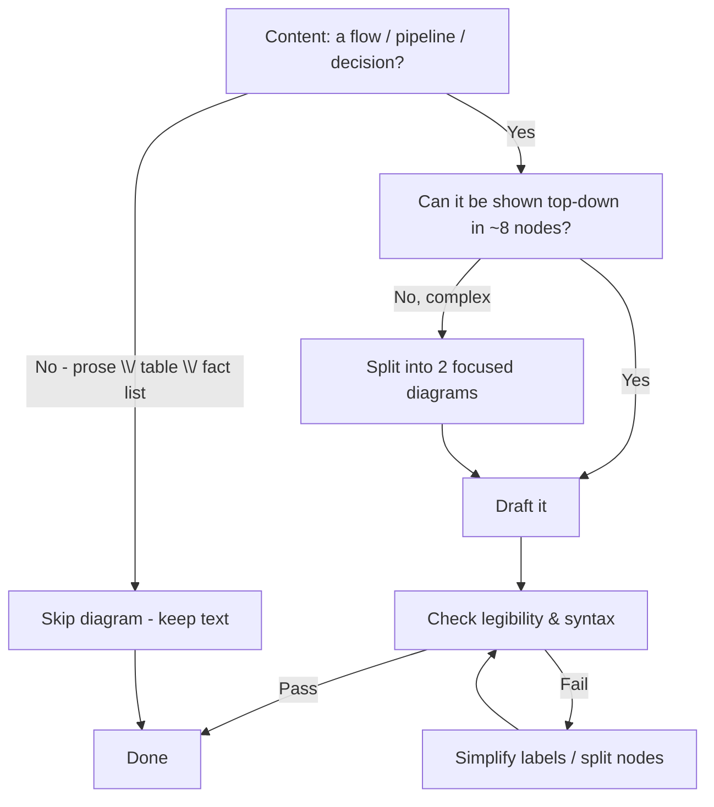

# Skill: Add a Mermaid Diagram

Trigger: you're writing/editing a markdown doc and a flow, pipeline, or decision tree would
clarify it. Goal: a diagram that **renders correctly on GitHub** and **stays legible** for a
user with poor eyesight.

## 0. Decide if a diagram is worth it



## 1. Draft

- `flowchart TD` is the default. Only `flowchart LR` for ≤5-node horizontal chains.
- Nodes: `A[Do thing]`, decisions `B{Ask?}`, critical path `A==>B`, async `A-.->B`.
- Labels ≤ ~50 chars. No markdown/backticks in node text.
- Edge labels short: `A -->|"yes"| B`, `A --> C`.

## 2. Legibility guardrail (hard)

- **Max 8–10 nodes per diagram.** More → split.
- **No subgraphs** unless they're genuine state groups.
- If the diagram would be wider than tall once labels render, restructure it: more vertical
  levels, shorter node text, or a second diagram.
- Read the rendered result out loud: could a person at arm's length read the smallest text? If
  unsure, reduce size/complexity — never ship a shrunken diagram.

## 3. Correctness checks before you're done

- Fence is exactly ` ```mermaid ` (no spaces inside the marker).
- Every `[` `]` `{` `}` `(` `)` in the block is balanced; quote labels containing specials:
  `A["text (v1)"]`.
- Node IDs: letters, no spaces.
- No raw pipes `|` in text → unquoted pipes break the diagram. Prefer `-->|"word"|` form.
- Diagram is renderable by GitHub's engine alone (Tauri/Node mermaid is NOT available in CI).

## 4. Definition of done

- Diagram adds real orientation, not decoration.
- Fits GitHub's default scale: no `width`, no cramped 20-node blobs, no long horizontal
  chains.
- Prose around it explains what it shows (never a diagram with zero context).
- Emoji balance honored per `rules/docs-format.md` — diagrams don't replace the document's
  scannable structure.

## Checklist

| Check | Gate |
| --- | --- |
| Worth it? | Content is a flow/pipeline/decision, not a fact list |
| Legible | ≤10 nodes, TD-default, no subgraphs, short labels |
| Syntactically valid | Balanced delimiters, quoted specials, valid fence |
| Context | Introduced and explained in surrounding prose |
| Consistent | Emoji + heading style per `docs-format.md` |