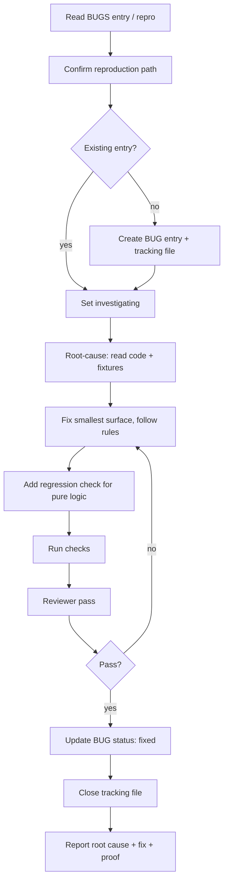
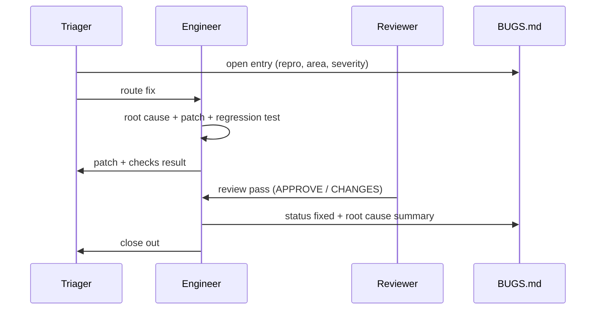

# Skill: Fix a Bug

Trigger: a `BUGS.md` entry (or a report). Goal: recording, fix, regression coverage, tidy
paper trail.

## Workflow

## Sequence (with docs)

## Rules

- **Reproduce before fixing.** If you can't reproduce, record environment/steps and stop
  rather than blind-patching.
- **Smallest surface.** One bug, one patch. Don't refactor adjacent code in the same diff.
- **Regression coverage** wherever the logic is pure (query builder, blacklist matcher,
  storage migration) — this is the repo's permanent invariant.
- A fix must also answer "why did the tests/checks not catch this" and close that gap.
- Update `BUGS.md` honestly: root cause (not speculation), verification evidence.