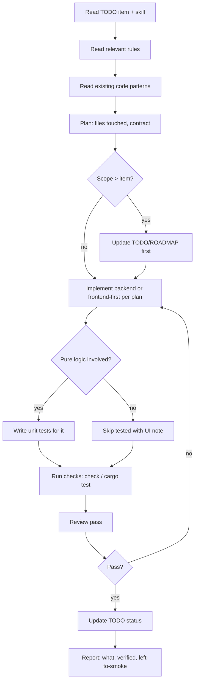
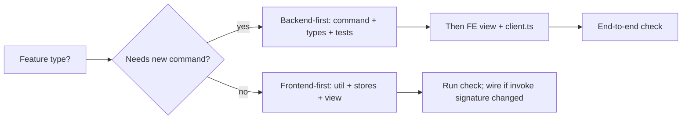

# Skill: Implement a Feature

Trigger: a `TODO.md` item (or user ask) describing a feature. Goal: ship it verified, with
tracking docs honest.

## Workflow

## Checklist

| Phase | Gate |
| --- | --- |
| Rules read | `rules/general.md` + the side's rule (`frontend`/`backend`) + `security.md` + `testing.md` |
| Existing patterns | Search for nearest equivalent before writing anything new |
| Contract | Find where frontend↔backend data crosses; types match exactly (`types.ts` ↔ serde) |
| Checks | `npm run check` (FE) · `cargo check`+`cargo test` (BE) |
| Tracking | `TODO.md` status + `ROADMAP.md` milestone if it completes one |
| Report | What changed · what was verified · what still needs a human smoke test |

## Frontend-first vs backend-first

## Definition of done (hard)

- Checks green; regression tests for any pure logic.
- Empty/error/loading states visible in the UI.
- Tracking docs updated in the same change.
- No comments added unless the task asked for them; no dead code; names self-document.