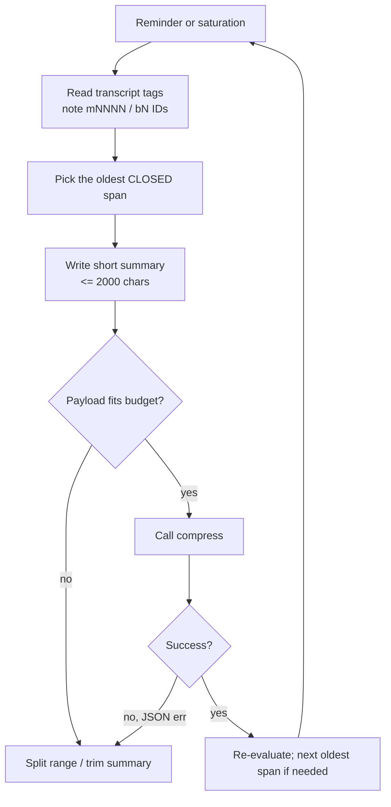

# Skill: Manage Context (compression pass)

Trigger: a `dcp-system-reminder` fires, the user says "compress / clean up context", or the
transcript is visibly saturated. Goal: reclaim context without losing intent or breaking the
`compress` tool.

## The one invariant

**Never let a `compress` call exceed ~7,000 characters of total JSON payload** (truncation
bites at ~8k; see `rules/context-management.md`). If you can't fit, you call `compress`
again with another range — never with an even longer payload.

## Workflow

## Pass layout

1. **Inventory.** Scan injected `<dcp-message-id>` tags and note the boundaries of each
   chapter (research / implementation / verification). Oldest first.
2. **Prove closure.** Only span old, resolved content. Never the newest active work; never
   exact code you need in the immediate next step.
3. **Budget the call.** Reserve ~500 chars of JSON overhead per range (keys, braces,
   quotes, `topic`). At ~1,500-char summaries per range, one call fits ~3 ranges.
4. **Write lean summaries.** Lead with the setting, then decisions/constraints/signatures,
   verification state, next moves. Quote short user directives verbatim. Mention internal
   `(bN)` placeholders only for blocks inside the range, exactly once each.
5. **Fire small.** One to three ranges per call. On error, split/shorten and retry; do not
   repeat the same oversized payload.
6. **Stop when effective.** One good pass usually reclaims enough; over-compressing the same
   turns kills cache and duplicates summaries.

## Size cheat-sheet

| Situations | Typical summary budget |
| --- | --- |
| Single closed chapter, routine | 600–1,200 chars |
| Chapter with hard-won decisions/trade-offs | 1,200–2,000 chars |
| Multi-range pass in one call | 3 × ≤1,500 = ~4,500 chars total |
| Anything bigger | Split across calls |

## Rules touched

- `rules/context-management.md` — contract, placeholders, protected tools, failure script.

## Definition of done

- Transcript visibly smaller; oldest spans replaced by one summary each `(bN)` block per
  previous compression where applicable.
- User intent preserved verbatim where it mattered.
- No active work compressed away; next moves still reachable from what remains.
- No failed tool call left un-explained; on failure, doc the cause and retry once lighter.