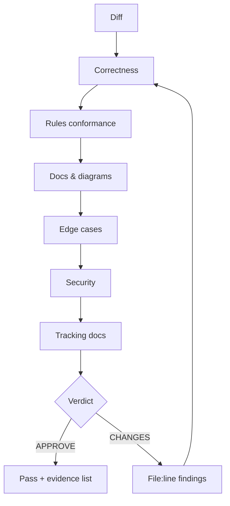
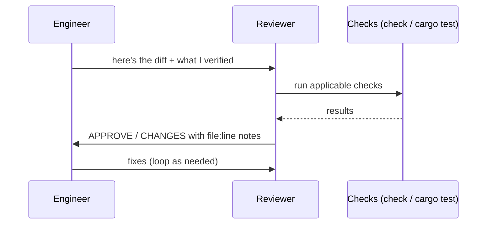

# Skill: Review Code

Trigger: a change is presented as done. Goal: verifiable "approved" outcome with evidence.

## Review passes (in order)

| Pass | Questions |
| --- | --- |
| Correctness | Does it do what the task said? Are the types right? Could it panic? |
| Rules | Naming, runes vs legacy, tokens vs hard-coded color, snake_case, no invented deps |
| Docs/diagrams | Emoji per `docs-format.md`; every `mermaid` fence valid, ≤10 nodes, TD-default, legible at GitHub scale |
| Edge cases | Empty results, error path, refresh, rapid double-click, offline, 404 image |
| Security | CSP still tight? API only via invoke? No `{@html}` of remote data? No secrets? |
| Tracking | `TODO.md`/`BUGS.md`/`ROADMAP.md` reflect the change? |

## Sequence

## Hard requirements on the verdict

- **Do not approve** if: checks error, pure logic lacks regression coverage, tracking docs
  are stale, or any remote/untrusted data is rendered unsafely.
- **Request changes** with `path:line` evidence for every finding; never vague.
- A reviewer approves *what was run*, and states what could still only be human-smoked
  (interactive flows).