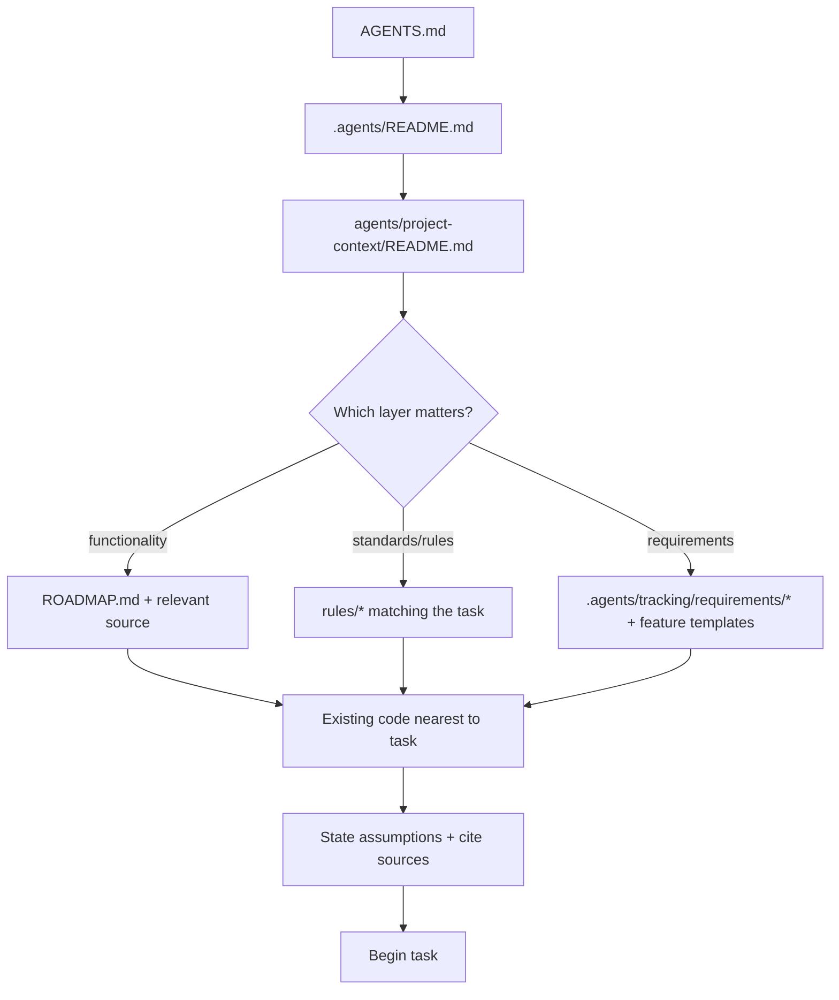

# Skill: Understand the Project

Trigger: **first task in this repo**, or a task in a domain you haven't touched yet. Goal:
build an accurate mental model of functionality, standards, and requirements in the fewest
reads — then start real work.

## Ramp-up (one pass, oldest to newest)

## Minimum reading set

| File | Why |
| --- | --- |
| `AGENTS.md` | identity trap, decision log, stack locks, commands |
| `.agents/README.md` | gateway, routing, who's who |
| `agents/project-context/README.md` | map of functionality, standards, requirements |
| Matching `rules/*` | the conventions that apply to your change side |
| Nearest existing code | the real patterns to follow |

## How to answer "how does X work?"

1. Grep for the feature name in `src/` and `src-tauri/src/` (e.g. `search`, `blacklist`).
2. Follow the request path front-to-back: UI view → `client.ts` invoke → `commands.rs` →
   `nh_desktop.rs` → serialized type → view. Read both direction's types.
3. For persistence: read `src/lib/cache.ts` (prefix `nh-desktop:`) and the SQLite table
   names (see `db.rs`) rather than guessing storage layout.
4. State your model in 3–5 lines with citations before touching code. If a doc contradicts
   the code, the code is ground truth for *behavior*, but flag the doc as stale
   (`rules/requirements.md`).

## ⚠️ Rules

- Cite where a fact lives; never restate from memory (identity trap applies — see
  `rules/project-identity.md`).
- Requirements are recorded, not invented (`rules/requirements.md`).
- Finish ramp-up before implementation, but cap it: reading is done when you can answer
  "does this change break anything?" for your first sub-task.

## ✅ Definition of done

- You can describe: the product (NH Desktop), the stack, the one-liner data path for your
  task, and the 1–3 rules that govern the diff you're about to make.