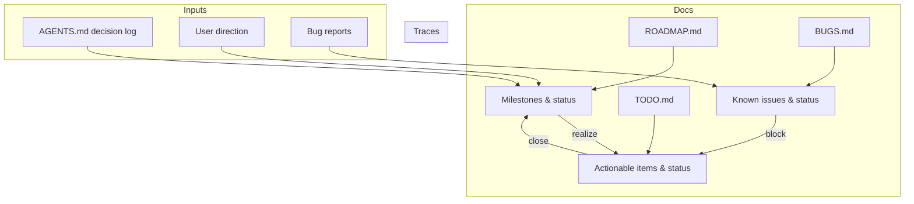

# Skill: Update Roadmaps & Tracking

Trigger: scope changed, a milestone landed, or `ROADMAP.md`/`TODO.md`/`BUGS.md` went stale.
Goal: the three docs stay truthful and cross-referenced.

## 🗺️ Truth grid



## ⚠️ Rules of mutation

- **Scope add/cut/reorder** → edit `ROADMAP.md` milestone table/current-focus, then sync
  `TODO.md`. Same change or not at all.
- **Task finished** → mark `[x]` in `TODO.md`, move under **Done**, link commit/PR id.
- **Bug found** → `templates/bug.md` entry in `BUGS.md`; triager routes. Never delete a
  `fixed` entry — it's history and regression context.
- **Anything set in stone** (stack, data model, persistence) → add one line to the
  **Decision log** in `AGENTS.md` and, if a rule follows, touch the rule too.
- **No orphan tracks.** Every ROADMAP milestone traces to TODO items; every TODO item
  traces to a milestone or backlog; every fix links its BUG entry.

## 🕑 Cadence

```mermaid
flowchart LR
    Change landing --> Sync[Update R/T/B in same change]
    Sync --> Q{Still consistent?}
    Q -- no --> Deep[Run update-roadmap routine again]
    Q -- yes --> Done[Ship]
```

## 🚫 Anti-patterns

- Docs that claim more done than checks prove.
- TODO items without a traceable milestone or backlog tag.
- ROADMAP statuses changed without the corresponding TODO work being closed.
- Decision log entries recorded after the fact without the rationale.