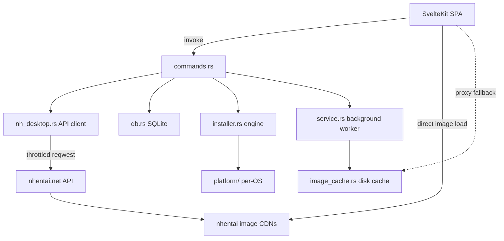

# NH Desktop

**A lightweight, modern, cross-platform desktop client for [nhentai.net](https://nhentai.net).**

NH Desktop is not a web wrapper. It is a native desktop application with its **own custom UI** and a
materially better **search & filter** and **global blacklist** experience than the site provides.
It imports as much data as the site's API makes available — galleries, tags, languages,
categories, artists, characters, parodies — and lets you slice it **locally, instantly**.

> **18+ only.** This application is intended for adults only. By using it you confirm that you
> are of legal age in your jurisdiction to view adult content.

---

## ✨ Highlights

- 🔍 **Search that actually works.** A filter drawer covers text, language, category, per-type tag
  include/exclude (artist, character, parody, group, …), page-count ranges, and six sort modes —
  compiled into native nhentai query syntax (`language:english`, `-tag:...`, `pages:>50`).
- **A blacklist you can trust.** Global, persistent, applied **server-side** (query `-tag:`
  excludes) *and* **client-side** (hide/blur in grids), with a master toggle. It never silently
  breaks the grid or the reader.
- **Native and fast.** Tauri 2 (Rust `reqwest`) backend, SvelteKit SPA frontend that uses Svelte 5
  runes. Everything runs locally; images load lazily with a Rust image-proxy fallback (backed by a
  disk cache) when the CDN 404s.
- **Background jobs built in.** Gallery zip downloads, image prefetch, cache/account maintenance,
  and an optional Popular auto-refresh run in a throttled background service, with live progress
  in Settings. Launching the app again just focuses the running window (single instance).
- **Private by default.** Favorites, history, blacklist, and settings live only on your device
  (`localStorage` + a local SQLite database). No accounts, no servers, no telemetry. An
  **optional** nhentai account API key unlocks account favorites/blacklist sync.
- **A real installer/uninstaller.** Tauri-native unified setup wizard (no NSIS/WiX): install,
  uninstall, repair, PATH registration, Desktop & Start Menu shortcuts — all in one binary.

## 🖥️ Platforms

| Platform | Support |
| --- | --- |
| Windows 10+ | ✅ |
| macOS 10.13+ | ✅ |
| Linux (x86_64) | ✅ (desktop entry, standalone install dir) |
| Mobile | ❌ (no mobile support; use [`NClientV3`](https://github.com/maxwai/NClientV3) on mobile) |

> **Why no mobile app?** Desktop-only by design. Android already has a good third-party
> client ([NClientV3](https://github.com/maxwai/NClientV3)), and iOS rejects NSFW apps while
> its developer license is prohibitively expensive. On a phone, use NClientV3 on Android or
> the site directly in a browser.

## 📦 Installation

Download the latest installer from the [Releases](https://github.com/HELIX-Origin/nhentai-desktop/releases)
page:

- 🪟 **Windows:** `NH Desktop-Setup-X.Y.Z.exe` — double-click and follow the wizard.
- **macOS:** `NH Desktop-X.Y.Z` (or the app bundle via your package manager of choice).
- **Linux:** `NH Desktop-X.Y.Z` — mark executable and run, or install into `~/.local/share`.

Run the binary again at any time to reach the **maintenance mode** (reinstall, repair shortcuts,
uninstall) via the sidebar's ⚙ Maintenance entry, or from the registry/app-store uninstall entry.

## 🛠️ Building from source

Requires **Node.js 20+**, **Rust stable**, and the per-platform Tauri prerequisites
([docs](https://v2.tauri.app/start/prerequisites/)).

```bash
npm install
npm run check          # svelte-kit sync + svelte-check (frontend type/lint)
cargo check            # run inside src-tauri/ (backend)
npm run dev:tauri      # run in dev mode (fixed Vite port 14440)
```

Full release bundle + installer:

```bash
npm run build:installer   # runs tauri build --no-bundle, assembles dist/installer/
```

## 🏗️ Architecture

Here is the app's high-level architecture: the SvelteKit SPA talks to Tauri commands in Rust,
which wrap the throttled nhentai API client, local SQLite persistence, and the installer engine.



## 🗂️ Project layout

```
src/                  # SvelteKit SPA frontend (static, adapter-static)
  lib/api/            # typed API client + query builder (frontend)
  lib/stores/         # settings, library, blacklist, account, service (runes + localStorage)
  lib/components/     # GalleryCard, GalleryGrid, FilterPanel, BlacklistView, ...
  routes/             # latest, popular, search, favorites, history, blacklist, settings, gallery, reader, installer
src-tauri/            # Rust backend (Tauri 2)
  src/nh_desktop.rs   # nhentai.net API client (reqwest, throttled)
  src/commands.rs     # Tauri commands (37)
  src/db.rs           # local SQLite persistence
  src/service.rs      # background worker queue (downloads, prefetch, maintenance, sync, auto-refresh)
  src/image_cache.rs  # disk image cache (cache-first proxy fallback)
  src/installer.rs    # unified installer/uninstaller engine
  src/platform/       # per-OS implementations (windows, macos, linux)
scripts/build-installer.mjs   # installer assembly
```

## 📚 Documentation

Full documentation lives in the [Wiki](https://github.com/HELIX-Origin/nhentai-desktop/wiki)
(available as [`wiki/`](wiki/) in this repository for contributions):

- [Home](wiki/Home.md) · [Getting Started](wiki/Getting-Started.md) · [Search & Filters](wiki/Search-and-Filters.md)
- [Blacklist](wiki/Blacklist.md) · [Reader & Galleries](wiki/Reader-and-Galleries.md) · [Settings & API Key](wiki/Settings-and-API-Key.md)
- [Installation & Maintenance](wiki/Installation-and-Maintenance.md) · [Architecture](wiki/Architecture.md)
- [Security](wiki/Security.md) · [Privacy](wiki/Privacy.md) · [Troubleshooting](wiki/Troubleshooting.md)
- [FAQ](wiki/FAQ.md) · [Roadmap](wiki/Roadmap.md)

Also see [PRIVACY.md](PRIVACY.md), [TOS.md](TOS.md), [SECURITY.md](SECURITY.md), and
[CHANGELOG.md](CHANGELOG.md) in this repository.

## 🤝 Contributing

See the [Wiki's Development section](wiki/Development-and-Contributing.md) and [SECURITY.md](SECURITY.md) for
reporting guidance. Be respectful, keep changes scoped, and match the existing conventions.

## 📄 License

MIT (see `LICENSE` in `package.json`). NH Desktop is an independent client and is not affiliated
with, endorsed by, or sponsored by nhentai.net. Please respect the site's
[terms of service](https://nhentai.net/info/terms/) and rate limits.