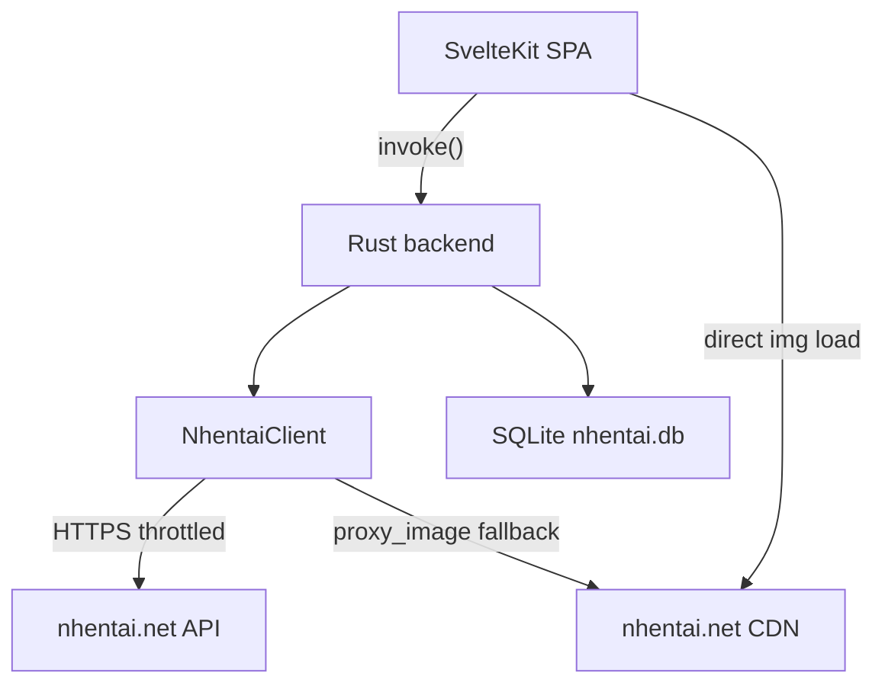

# Architecture

High-level picture of how the app is built and why.

Here's the shape of the whole system — SvelteKit on top, Rust under it, nhentai.net below:

Rust owns all networking and local data; the SPA only renders. Images load straight from the
CDNs, with Rust as the proxy fallback.

## 🏗️ Design decisions

1. ✅ **Desktop shell = Tauri 2.** Rust backend owns all networking and persistence; the SPA is
   just presentation. Everything the site's API exposes is imported and re-sliced locally.
2. **One binary = app + installer.** The same executable is the app, the installer, and the
   uninstaller (arg-route based, `main.rs`). No NSIS/WiX/MSI packaging.
3. **Local-first.** No server, no accounts required. Favorites/history/blacklist/settings and
   the cache live on-device by default; an optional nhentai.net API key adds account sync.
4. **Images = direct + proxy fallback.** `` from the CDNs first; `proxy_image` (Rust →
   bytes → `blob:` URL) if the CDN 404s (legacy galleries are known to).
5. **Blacklist is two layers.** Server-side `-tag:` excludes in every query, plus client-side
   hide/blur in grids, plus a master toggle. See [Blacklist](Blacklist.md).
6. **Plain CSS tokens.** Custom design system in `src/lib/design/tokens.css` + `base.css`;
   no CSS framework, no Tailwind — deliberate (see README).

## ⚡ Frontend → Backend contract

- ⚡ Frontend calls typed commands through `src/lib/client.ts` (a thin `invoke()` wrapper) and
  `src/lib/api.ts` (the higher-level typed API surface).
- Command names are camelCase (`fetch_new`, `search_galleries`, `proxy_image`, …); the full
  list lives in [Backend (Rust)](Backend-Rust.md).
- Errors cross the bridge as `Result<_, String>` (never Rust panics) and render as friendly
  notice components.

## 🦀 Backend → nhentai.net

- 🦀 All requests go through `NhentaiClient` (reqwest, `rustls`, gzip). A `THROTTLE` delay
  between requests respects the site's public API (see `nhentai.rs`). No hammering. Ever.
- Type-accurate serde models mirror the API JSON.

## 💾 Persistence model

| Store | Location | Purpose |
| --- | --- | --- |
| Favorites / history / blacklist / settings | `localStorage` | user state, runes-backed |
| Cache mirror + API key | `nhentai.db` (SQLite) | fast startup, offline-ish lists, key at-rest |

## 🤝 Related pages

- [Backend (Rust)](Backend-Rust.md) · [Frontend (SvelteKit)](Frontend-SvelteKit.md) ·
  [Installer Engine](Installer-Engine.md) · [Security](Security.md) · [Privacy](Privacy.md)