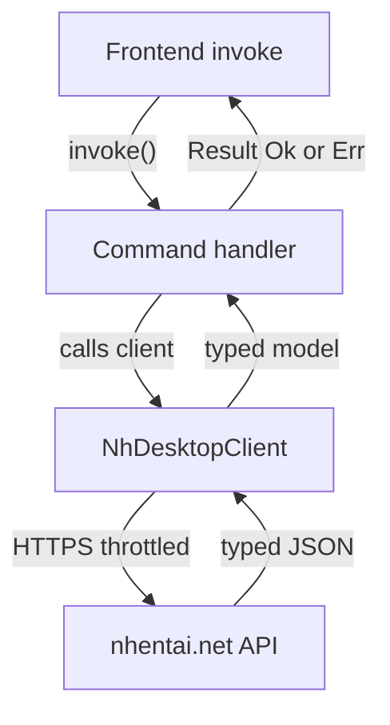

# Backend (Rust)

The Tauri 2 Rust backend lives in `src-tauri/`. It owns **all networking**, **local
persistence**, the **installer engine**, and keeps the WebView sandboxed. No panic crosses
the command boundary: every command returns `Result<_, String>`.

Here's the lifecycle of a request, from UI to nhentai.net and back:

## 🧩 Modules

| File | Responsibility |
| --- | --- |
| `src-tauri/src/nh_desktop.rs` | `NhDesktopClient` — typed nhentai.net API client (reqwest) + `THROTTLE` |
| `src-tauri/src/commands.rs` | All `#[tauri::command]` handlers (37) |
| `src-tauri/src/db.rs` | SQLite persistence (`Db`, `nh-desktop.db`) |
| `src-tauri/src/service.rs` | `BackgroundService` — throttled worker queue (downloads, prefetch, maintenance, sync, auto-refresh) |
| `src-tauri/src/image_cache.rs` | `ImageCache` — disk image cache at `cache/images`, backing `proxy_image` |
| `src-tauri/src/installer.rs` | Unified installer/uninstaller engine |
| `src-tauri/src/platform/{mod,windows,macos,linux}.rs` | Per-OS implementations |
| `src-tauri/src/error.rs` | Friendly error type |
| `src-tauri/src/main.rs` | Entry point + arg routing (app vs installer) |

## ⚡ Commands (the full surface)

All are camelCase, registered on the Tauri invoke handler.

### 🔍 Display & discovery

| Command | What it does |
| --- | --- |
| `fetch_new` | New/recent galleries (paginated) |
| `fetch_popular` | Popular galleries (site's list) |
| `fetch_tagged` | Galleries for a tag (type, sort, page) |
| `search_galleries` | Search with query text + sort + page |
| `fetch_gallery` | Single gallery detail (with favorite state) |
| `related_galleries` | Related galleries for a gallery id |
| `fetch_tag_info` | Tag metadata by `type`/`slug` |
| `proxy_image` | Fetch image bytes (CDN fallback) → `Vec<u8>` (served from the disk image cache first) |

### 💾 Local DB (key/value)

| Command | What it does |
| --- | --- |
| `db_get` / `db_set` / `db_del` | Single key operations |
| `db_dump` / `db_clear` | Full-table dump / clear (cache mirror) |

### 🔑 Account / API key

| Command | What it does |
| --- | --- |
| `set_api_key` / `get_api_key_status` / `clear_api_key` | Store/query/clear the local API key |
| `verify_api_key` / `get_current_user` | Validate key; fetch `/api/v2/user` (`Authorization: Key <key>`) |
| `check_favorite` / `add_favorite` / `remove_favorite` | Account favorite state |
| `fetch_favorites` | Remote favorites list |
| `fetch_account_blacklist` / `update_account_blacklist` | Account blacklist sync |
| `download_gallery` | Legacy direct download (returns URL); prefer background-service downloads |

### 🛰️ Background service

`BackgroundService` (`service.rs`) runs a single throttled worker; jobs are enqueued as
`service://job` events stream progress to the UI.

| Command | What it does |
| --- | --- |
| `service_enqueue_download` | Download gallery zip → disk (progress events); returns job id |
| `service_enqueue_prefetch` | Prefetch a list of image URLs into the image cache |
| `service_enqueue_maintenance` | Prune image cache (30d) + cached lists (7d) |
| `service_enqueue_sync` | Account favorites + blacklist sync into cached mirrors |
| `service_status` | Pending job count |
| `service_set_auto_refresh` | Enable/disable Popular auto-refresh (interval `≥15` min) |
| `service_get_auto_refresh` | Current auto-refresh config |

### 📦 Installer

| Command | What it does |
| --- | --- |
| `installer_status` | Installed? version, install dir, OS |
| `installer_disk_space` | Disk-space check for a target dir |
| `installer_install` | Perform install (options → `OperationResult`) |
| `installer_uninstall` | Perform uninstall (options → `OperationResult`) |
| `open_maintenance_window` | Reuse/focus or build the installer window |

## 🦀 Networking rules

- 🦀 **One client, one place:** `NhDesktopClient` is the only thing touching nhentai.net.
- **Respect the site:** a `THROTTLE` sleep keeps requests human-paced; single-flight/reuse
  patterns avoid fan-out. The background service runs one job at a time.
- **Image hosts:** any `*.nhentai.net` subdomain is accepted (`is_allowlisted_image_host`),
  so `t.`/`i.`/`static.` all work; matching CSP `img-src` in `tauri.conf.json`.
- **Typed serde models** mirror the API JSON 1:1; deserialization tests cover the shapes.
- **TLS:** `reqwest` with `rustls` (no OpenSSL dependency), gzip enabled.

## 🚨 Error handling

- 🚨 `error.rs` provides friendly error types; commands never return `panic!`.
- Failure to load a resource (image/CDN) is signaled with a clean `Err(String)` the UI renders
  as a retryable notice (see [Reader & Galleries](Reader-and-Galleries.md)).
- The DB is behind a `Mutex<Connection>`; all access is short-lived and unlock-and-drop.

## 📦 Platform modules

`platform/mod.rs` selects `windows`/`macos`/`linux` at compile time. Each platform module
exposes the **same function surface** (enforced by the compiler): `executable_name`,
`default_install_dir`, `installed_exe_path`, `place_executable`, shortcut create/remove,
register/unregister uninstall, PATH add/remove, and `launch`. The installer engine calls only
traits-shaped `platform::*` free functions, so all orchestration is platform-agnostic. Details:
[Installer Engine](Installer-Engine.md).

## 🤝 Related

- [Architecture](Architecture.md) · [Frontend (SvelteKit)](Frontend-SvelteKit.md) ·
  [Security](Security.md)