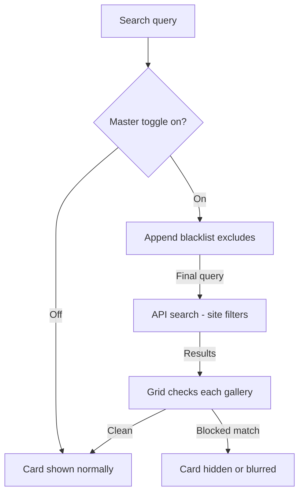

# Blacklist

The blacklist is one of the product's core reasons to exist. The site's own filtering is a
known weakness; the client replaces it with a **global, persistent, two-layer blacklist** that
never leaves you stranded with an empty grid.

## 🚫 How it works (two layers)

1. **Server-side (query excludes).** Every search query the app runs gets your blacklist's
   *tag exclusions* appended (`-tag:...`, `-artist:...`, etc.) via
   `buildServerExcludes()`. The site itself filters — results genuinely exclude blacklisted
   content, and remain paginated normally.
2. **Client-side (hide/blur).** The grid additionally checks every rendered gallery against
   the blacklist and **hides** (or **blurs**) offending cards. This catches metadata-only
   cases (e.g. blacklisted *text* that matches a title) that server-side can't.

A **master toggle** switches the entire blacklist on/off instantly — if a search ever feels
"too empty," flip it off and the full unfiltered results come back.

One picture of the two-layer pipeline, including what the master toggle disables:

With the toggle **off**, the whole pipeline is bypassed — the grid shows whatever the site
returns.

## 🛠️ Managing the blocklist

**Blacklist** in the sidebar opens the management view:

- **Add a tag** — from any gallery (quick-add in the detail page) or manually by name/type
  (artist, character, parody, group, language, category, tag).
- **Add text patterns** — e.g. a series name you're tired of. Text entries are matched against
  gallery text fields client-side.
- **Remove / edit entries** — inline in the list.
- **Import/export** — JSON export/import of the whole list (planned — see
  [Roadmap](Roadmap.md)).

## 🕵️ Privacy & where it lives

- Blacklist entries persist in `nh-desktop.db` via the SQLite-backed cache. They **never leave
  your device** except as tag-excludes rewritten into a query sent to nhentai.net — the site
  never sees a "blacklist", only normal exclude tokens.
- There is no server-side "blacklist account" unless you also use the **optional API key**
  account-sync feature (`fetch_account_blacklist` /
  `update_account_blacklist`), which syncs with *your* nhentai.net account's own blacklist —
  your choice.

## 🖼️ Behavior in grids

| State | Grid behavior |
| --- | --- |
| Blacklist on, hidden mode | Matching cards are removed entirely — the grid stays clean. |
| Blacklist on, blur mode | Cards remain but are blurred; hover reveals them (nuisance-free). |
| Blacklist off (toggle) | No filtering at all — full unfiltered results. |
| Direct-link galleries | Blacklisting never blocks a gallery you opened directly (detail/reader stay accessible by design) — it governs discovery lists. |

## ⚠️ Edge cases

- **Rare/legacy galleries** whose tags diverge from the site metadata still get caught by the
  client-side text/title matcher.
- The site has no stable "popularity" sort field — blacklist excludes are query-based and
  do not affect the available sort orders.
- If a blacklisted tag is present on a gallery *you* made a direct link to, the detail page is
  still accessible (see "Explicitly not bugs" in `BUGS.md`).

## 🏗️ Source

- Store: `src/lib/stores/blacklist.svelte.ts`
- Server-side exclude builder: `buildServerExcludes()` (same module)
- Tauri commands: `fetch_account_blacklist`, `update_account_blacklist`

---

- Previous: [Search & Filters](Search-and-Filters.md) · Next: [Favorites & History](Favorites-and-History.md)