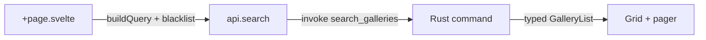

# Frontend (SvelteKit)

The entire UI is a static SvelteKit SPA (no SSR) running inside a Tauri 2 WebView. Stack:
**Svelte 5 runes**, **TypeScript strict**, **plain CSS design tokens** (no framework).

## 🧩 Source layout

```
src/lib/
  api.ts            typed higher-level API surface (search, lists, gallery, …)
  client.ts         thin invoke() wrapper for Tauri commands (camelCase)
  types.ts          shared types mirroring serde models (Gallery, Tag, …)
  query.ts          buildQuery() → nhentai search syntax + SORT_OPTIONS
  cache.ts          in-memory/session cache (prefix 'nh-desktop:')
  image.ts          URL helpers (IMAGE_HOST/THUMB_HOST/AVATAR_HOST) +
                    pagePath()/thumbPath()/avatarUrl() + proxiedBlobUrl()
  format.ts         display helpers (sizes, dates, counts)
  stores/           runes state (favorites/history/blacklist/settings/account/service)
  components/       GalleryCard, GalleryGrid, FilterPanel, ReaderImage,
                    CoverImage, Pager, Loader, Drawer, TagChip, EmptyState,
                    ErrorNotice, SettingsView, FavoritesView, HistoryView,
                    BlacklistView, Icon
  design/           tokens.css (colors/spacing/radius/type), base.css (globals)

src/routes/
  +layout.svelte    app shell: sidebar nav, boot splash, sub-window passthrough
  +page.svelte      Latest (new releases, paginated)
  popular/          Popular
  favorites/  history/  blacklist/  settings/
  search/           search bar + FilterPanel drawer + results grid
  gallery/[id]/     gallery detail (+ actions, related, tags)
  gallery/[id]/reader/   paged/strip reader
  installer/        separate frameless wizard window (see Installer Engine)
```

## ⚡ Conventions

- ⚡ **Kebab-case filenames**, PascalCase component names.
- **Svelte 5 runes** (`$state`, `$derived`, `$effect`) — no legacy stores for UI state.
- **localStorage** backs favorites/history/blacklist/settings; runes hydrate/serialize via
  the `stores/` modules (`localStorage` namespaced keys).
- All async reads go through the typed `api`/`client` layer; never raw `invoke` in components.
- Image URLs are derived from the API's relative path fragments via `image.ts`
  (`pagePath` / `thumbPath` / `avatarUrl`); images render direct from the `*.nhentai.net` CDNs
  and fall back to a `blob:` URL from `proxy_image` (served from the disk image cache) when the
  CDN 404s (see [Reader & Galleries](Reader-and-Galleries.md)).

## 🔍 Event flow (example: search)

The chain is short — four hops from page to grid:



In full:

1. 🔍 `search/+page.svelte` builds a `FilterModel` → `buildQuery(model)` + blacklist excludes →
   `api.search(query, sort, page)`.
2. `client.ts` calls `invoke('search_galleries', { query, sort, page })`.
3. Rust returns `GalleryList` (typed); grid + pager render; `ErrorNotice` shows failures.

## 📦 Child / helper windows

The layout detects sub-window routes (`/installer`) and renders them **without** the normal
app shell (no sidebar). The maintenance window is opened from e.g. settings / sidebar via
`open_maintenance_window` (Rust) — see [Installer Engine](Installer-Engine.md).

## 🔄 Background services

`src/lib/stores/service.svelte.ts` surfaces the Rust background service (`service.rs`): a
throttled one-at-a-time queue for gallery downloads (zip to disk), image prefetch, cache/image
maintenance, account sync, and periodic Popular auto-refresh. It listens for the
`service://job` / `service://refresh` Tauri events, keeps the last 50 job records, and renders
them live in **Settings → Background services**. The store exposes `enqueueDownload`,
`prefetchImages`, `enqueueSync`, `enqueueMaintenance`, and reads/writes the auto-refresh config
(`service_set/get_auto_refresh`).

## 🎨 Design system

Tokens live in `design/tokens.css`: dark-first palette (bg/elevated/surface/border/text),
violet accent `#7c5cff`, semantic danger/success/warning, radius/shadows and `--sidebar-w` /
`--topbar-h` layout vars. A light theme (`[data-theme='light']`) is reserved. Base styles and
shared `.btn`, `.input`, `.page` etc. live in `design/base.css`.

## 🤝 Related

- [Architecture](Architecture.md) · [Backend (Rust)](Backend-Rust.md) ·
  [Reader & Galleries](Reader-and-Galleries.md)