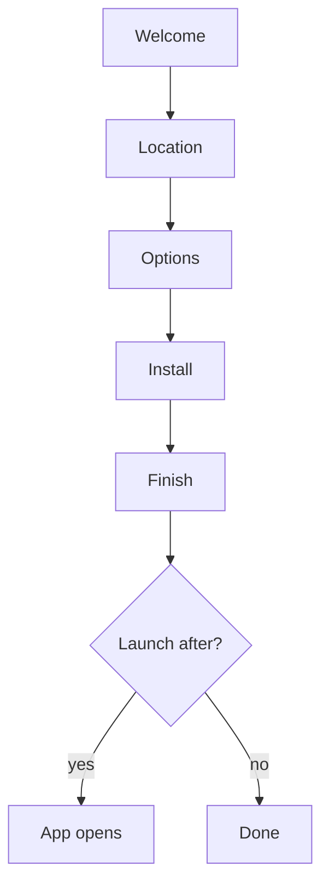

# Installation & Maintenance

NH Desktop ships a **native Tauri installer/uninstaller** (no NSIS/WiX). A
single binary is both the app and the setup wizard: run the same executable to launch the app
normally, or the installer variant to install/repair/uninstall.

## 📦 Installing

The wizard walks through the same screens on every platform:

### 📦 Windows

1. 📦 Download `NH Desktop-Setup-<version>-win-x64.exe` (filename includes the target
   platform/arch) from the
   [Releases](https://github.com/HELIX-Origin/nhentai-desktop/releases) page.
2. Run it. The wizard steps: **Welcome → Location → Options → Install**.
3. Default install dir: `%LOCALAPPDATA%\Programs\NH Desktop` (falls back to
   `C:\Program Files\NH Desktop`).
4. Options (all on by default):
   - Create a **Desktop shortcut**
   - Create a **Start Menu shortcut**
   - Enable **CLI access (PATH)** — the `NH Desktop` command becomes available in a terminal
   - **Launch after finish**
5. **Finish** — the app opens (if you chose launch-after).

### 📦 macOS

1. 📦 Download the release bundle.
2. The app installs into `/Applications` and a **Desktop alias** is created (via AppleScript).
3. Launch via the alias or Launchpad. Registering/unregistering is handled by LaunchServices;
   modern macOS will ask for confirmation the first time you open it (unsigned builds).

### 📦 Linux

1. 📦 Download the release binary.
2. Run the wizard or install manually into `~/.local/share/NH Desktop`.
3. Installation writes a **desktop entry** at
   `~/.local/share/applications/NH Desktop.desktop` (and the app appears in your launcher), plus
   a symlink `~/.local/bin/NH Desktop` for CLI access.

## 🛠️ Maintenance mode

Run the app binary with any of these flags (or the installed entry points):

| Flag | Effect |
| --- | --- |
| `--installer` | Open the setup wizard |
| `--maintenance` | Open the **Maintenance** page of the wizard (reinstall/repair/uninstall) |
| `--uninstall` | Open the **Uninstall** flow |
| `--setup` | Alias for `--installer` |

The Windows uninstall registry entry (`HKCU\Software\Microsoft\Windows\CurrentVersion\Uninstall\NH Desktop`)
launches the wizard with `--installer --maintenance` automatically, and the app's sidebar ⚙
**Maintenance** button opens the same window.

From the **Maintenance** page you can:

- 🛠️ **Reinstall / Update** — keep settings, reinstall the binary.
- **Repair Shortcuts** — recreate Desktop/Start Menu shortcuts and the uninstall entry.
- **Uninstall** — remove shortcuts, PATH entry, uninstall key, and (optionally) **remove
  user data** (favorites, history, blacklist, settings, cached images).

### ⚠️ Uninstall options

The uninstaller asks whether to **delete all local user data**. Choose carefully:

- ⚠️ Leave it off to keep your `localStorage` and `nh-desktop.db` (handy for reinstall or update).
- Enable it to wipe everything — this is the "factory reset".

## ❓ Common questions

- ❓ **Can I run both app and installer at once?** Yes — the wizard opens in a separate frameless
  window; the main app is unaffected. Only one installer window is allowed (focus is reused).
- **Where's the data stored?** See [Privacy](Privacy.md) for exact paths.
- **Why no .exe/.msi bundles?** The product intentionally uses the Tauri-native unified
  installer; Windows installer bundles (WiX/NSIS) are deliberately not used.

---

- Related: [Installer Engine](Installer-Engine.md) (how it works) · [Getting Started](Getting-Started.md)