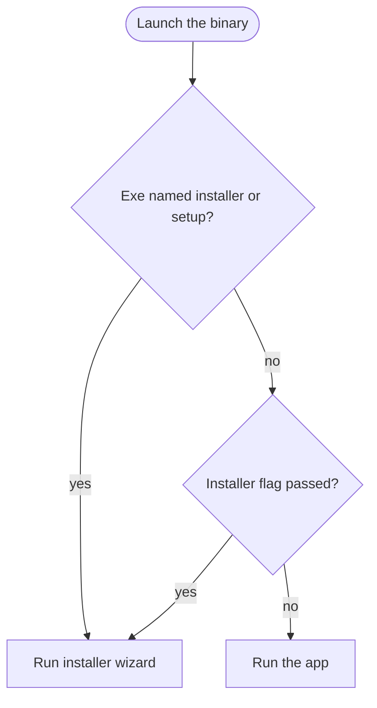
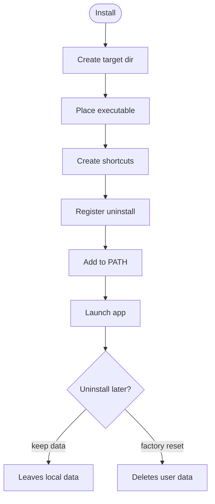

# Installer Engine

NH Desktop ships as a **single native binary** that is the app AND the installer/uninstaller.
No NSIS, no WiX MSI. The pattern: the same executable routes on argv.

## 📦 Entry point routing

`src-tauri/src/main.rs`:

| Condition | Action |
| --- | --- |
| exe filename contains `installer` / `setup` | run installer wizard |
| any arg `--installer` / `--setup` / `--uninstall` / `--maintenance` | run installer wizard |
| otherwise (no special flag) | run the app |

The same decision as a small tree:

On Windows release the `windows_subsystem = "windows"` attribute hides the console. The
installer registers an HKCU uninstall entry whose `UninstallString` is
`"<exe>" --installer --maintenance`, so "Add/Remove Programs" launches the maintenance
wizard.

`main.rs` → `run_installer()` (lib.rs) builds a Tauri app with only the installer commands;
it opens a frameless `installer` window (`NH Desktop Setup`, 820×620, min 720×560, centered,
`installer?mode=install|maintenance`).

## 📦 Engine (`src-tauri/src/installer.rs`)

- 🧩 `InstallerStatus` — `is_installed`, `installed_version`, `current_version`,
  `default_install_dir`, `current_exe_path`, `os`.
- `DiskSpaceInfo` — `available_bytes`, `required_bytes`, `has_sufficient_space`
  (required ≈ 128 MB).
- `InstallOptions` — `target_dir`, `create_desktop_shortcut`, `create_start_menu_shortcut`,
  `add_to_path`, `launch_after`.
- `UninstallOptions` — `remove_user_data`.
- `OperationResult` — `success`, `message`, `details[]` (logged by the wizard).

`current_version()` reads `CARGO_PKG_VERSION`; `detect_status()` and `check_disk_space()`
inspect the target OS.

## 📦 Platform layer (`src-tauri/src/platform/`)

`mod.rs` selects `windows` / `macos` / `linux` at compile time. Each implements the **same
surface** (compiler-enforced): `executable_name`, `default_install_dir`, `installed_exe_path`,
`place_executable`, shortcut create/remove, uninstall register/unregister, PATH add/remove,
`launch`.

| Platform | Default install dir | Highlights |
| --- | --- | --- |
| **Windows** | `%LOCALAPPDATA%\Programs\NH Desktop` (fallback `C:\Program Files\NH Desktop`) | `.lnk` shortcuts (PowerShell WScript.Shell), HKCU uninstall key, user-PATH entry, `NH Desktop.exe` |
| **macOS** | `/Applications` | real `.app` bundle (Contents/MacOS/NH Desktop + Info.plist), desktop alias via osascript, `open` launch |
| **Linux** | `~/.local/share/NH Desktop` | `.desktop` entries (+ uninstall entry), `~/.local/bin` symlink on PATH |

Install flow (`perform_install`): create target → `place_executable` → shortcuts → register
uninstall → PATH (+ launch after). Uninstall (`perform_uninstall`): reverse, then optionally
remove user data under `dirs::data_dir`/`data_local_dir`.

The full lifecycle at a glance:

## ⚡ Commands

`installer_status`, `installer_disk_space`, `installer_install`, `installer_uninstall`,
`open_maintenance_window`. See [Backend (Rust)](Backend-Rust.md).

## 🛠️ Building the installer binary

`scripts/build-installer.mjs` (`npm run build:installer`): runs `tauri build --no-bundle`,
then copies `src-tauri/target/release/nhentai(.exe)` to `dist/installer/` as
`NH Desktop-Setup-{version}.exe` (and `NH Desktop-Setup.exe`). Because the binary routes on its
own filename, the "Setup" name triggers the install wizard. See
[Installation and Maintenance](Installation-and-Maintenance.md).

## 🤝 Related

- [Installation and Maintenance](Installation-and-Maintenance.md) ·
  [Architecture](Architecture.md) · [Security](Security.md)