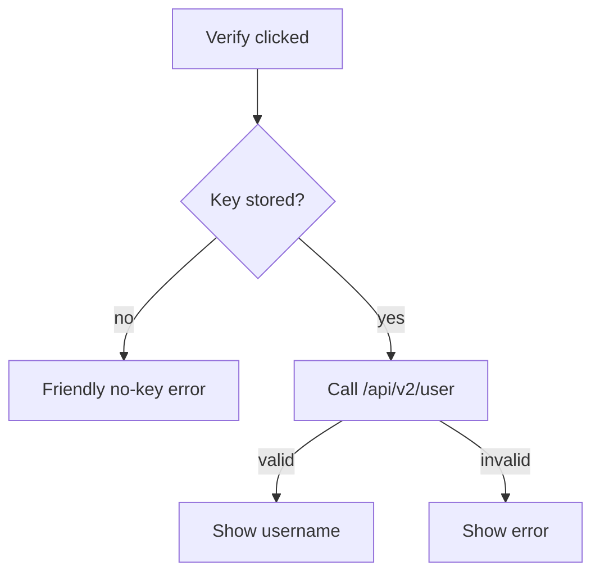

# Settings & API Key

**Route:** Settings · component `src/lib/components/SettingsView.svelte`

Settings are kept deliberately small and local. All settings persist via the SQLite-backed
KV cache (`src/lib/cache.ts` → `nh-desktop.db`; dark theme active; a light theme is reserved
behind `[data-theme='light']`).

## ⚙️ Appearance

- 🎨 **Theme:** light, dark, or system (follows the OS). Cycle with the button, or set it in the
  store directly.
- 📐 **Grid density:** `Cozy` or `Compact`.
- 🌍 **Language:** pick the interface language from the dropdown. Defaults to your system locale
  on first launch; changes apply immediately and are shared with the installer. English,
  Japanese, and Chinese (Simplified + Traditional) are complete — see
  [Localization](Localization.md) to help add another.
- Accent color and image-quality/reader-preference options are planned (Settings backlog).

## 🔑 API key (optional)

The only "online" setting. Get a key from nhentai.net → *Settings → API Key*.

| Control | Behavior |
| --- | --- |
| **Add API key** | Stores the key locally in `nh-desktop.db` (the `api_key` table). The UI shows only a 4-character prefix after saving. |
| **Verify** | Calls nhentai.net's `/api/v2/user` with the stored key (`Authorization: Key <key>`) and shows your username if valid. |
| **Clear** | Removes the stored key from the local DB immediately. |

The **Verify** control's decision tree:

### 🔑 What the key enables

- 🔑 Account favorites sync (`check_favorite`, `add_favorite`, `remove_favorite`,
  `fetch_favorites`).
- Account blacklist sync (`fetch_account_blacklist`, `update_account_blacklist`).
- Background gallery downloads (`service_enqueue_download` — zip to disk via the background
  service; key required).

### 🔒 Security notes

- 🔒 Keys are stored **only locally** (SQLite), never logged, never sent anywhere except
  nhentai.net over HTTPS (as the `Authorization` header — the user endpoint uses
  `Key <key>`).
- The Rust commands `require_key`/`optional_key` (`commands.rs`) ensure commands that need a
  key fail with a friendly error when missing — the UI never silently passes an empty key.
- Clearing the key is immediate; future command calls then fall back to anonymous mode or
  return "no API key configured".

## 💾 Cache

- 💾 **Clear cache** — flushes the in-memory Redis-style cache and the mirrored SQLite table
  (`cacheFlush()` → `clear_db`). Safe: it only drops cached lists/images, never favorites,
  history, blacklist, settings, or the API key.
- The cache stores recent gallery/list payloads under the `nh-desktop:` prefix and rehydrates on
  launch (`cacheInit()`), keeping repeat navigation instant and reducing load on the site.

## 🔄 Background services

Settings → **Background services** (backed by `src-tauri/src/service.rs` + the runes store
`src/lib/stores/service.svelte.ts`):

| Control | Behavior |
| --- | --- |
| **Auto-refresh Popular** | Toggle periodic Popular-list refreshes; when on, pick **15 min / 1 hour / Daily** (persisted via `service_set_auto_refresh`). |
| **Sync account** | Pulls account favorites + blacklist into the local mirror (`service_enqueue_sync`). |
| **Run maintenance** | Prunes the disk image cache (30-day images) and cached lists (7 days) (`service_enqueue_maintenance`). |
| **Recent jobs** | Live list of background jobs with progress, streamed over the `service://job` / `service://refresh` events (download, prefetch, maintenance, refresh, sync). |

The service processes jobs one at a time from a throttled queue. Downloads land in the
`downloads/` folder of the app data dir. See [Backend (Rust)](Backend-Rust.md) for the
`service_*` commands.

## ⚙️ Other settings surfaces

Beyond the Settings page, related persistent state lives in:

- ⚙️ `src/lib/stores/settings.svelte.ts` — user preferences
- 🌍 `src/lib/stores/locale.svelte.ts` — interface language + system-locale detection
- ⚙️ `src/lib/stores/library.svelte.ts` — favorites/history persistence
- ⚙️ `src/lib/stores/blacklist.svelte.ts` — the global blacklist + master toggle
- ⚙️ `src/lib/stores/account.svelte.ts` — account/API-key state
- ⚙️ `src/lib/stores/service.svelte.ts` — background-service jobs + auto-refresh config

## 🤝 Related

- [Search & Filters](Search-and-Filters.md) · [Blacklist](Blacklist.md)
- [Localization](Localization.md) — language packs and how to contribute one
- [Backend (Rust)](Backend-Rust.md) — the commands behind these toggles