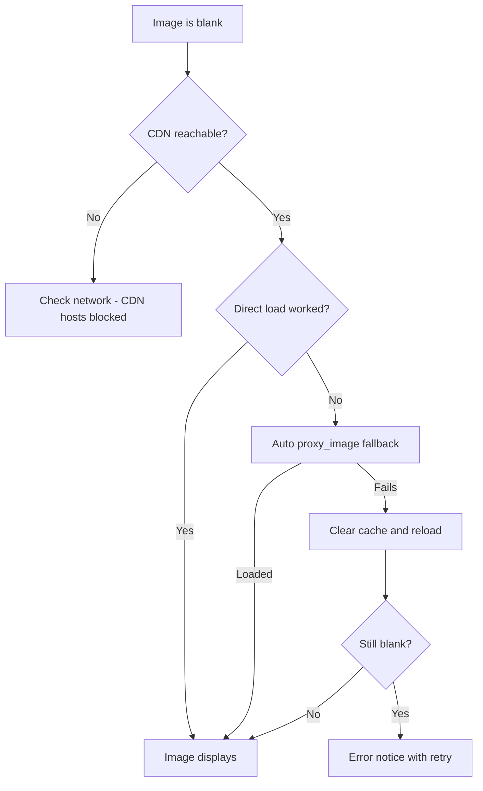

# Troubleshooting

Common problems and fixes. If the same issue persists after these steps, open a GitHub issue
with the steps you took and the relevant log/error text.

## 📦 Installation

### 🚨 "The app won't install / shows nothing"

- On Windows, run the uninstall/repair from **Settings → Apps → NH Desktop → Modify** (or the
  maintenance window in-app via the sidebar → **Modify installation**).
- On macOS, drag the `.app` into `/Applications`, then double-click.
- On Linux, make sure `~/.local/share/NH Desktop` is writable and the `.desktop` entry was
  created.

### 🚨 "Setup disappears after running"

The installer binary is the app binary. If the file is named `NH Desktop-Setup-*.exe`
(any platform-tagged variant, e.g. `NH Desktop-Setup-0.2.0-win-x64.exe`), double
clicking it opens the wizard. If it was renamed to just `NH Desktop.exe`, it starts the main
app instead. Re-run via a correctly-suffixed copy, or pass `--installer`.

## 🖼️ Loading / images

### 🚨 Galleries load but images are blank

- Older builds joined the API's relative image paths onto the CDN host incorrectly, so nothing
  loaded. That bug is fixed — URLs are now derived from the API's path fragments via
  `image.ts` (`pagePath` / `thumbPath` / `avatarUrl`). If you still see blanks, the fixes below
  apply.
- Check the network: nhentai.net's CDN hosts (`t.` / `i.` / `static.`) must be reachable (CSP
  already allows `https://*.nhentai.net`).
- Some legacy galleries 404 on the CDN. The app auto-falls back to its image proxy
  (`proxy_image` → `blob:`, served from the on-disk image cache `cache/images`); if that still
  fails you'll see an error notice with a retry.
- **Settings → Cache** clears the in-memory/mirror cache; the on-disk image cache is pruned
  automatically by *Background services → Run maintenance* (images older than 30 days).

Stuck on blank images? Follow this decision tree:

### 🚨 "Network error" or timeouts

- nhentai.net rate-limits. The app throttles requests, but rapid pagination can still hit a
  wall — wait a moment and retry (the UI shows a retry button on notices).
- Restart the app; the client rebuilds its connection.

## 🔍 Search & filters

### 🚨 "Search returns wrong / no results"

- Check the nhentai query syntax (see [Search & Filters](Search-and-Filters.md)): exclusion
  needs the `-` prefix (`-tag:loli`), `tag:`, `artist:`, `language:english`, etc.
- Note the blacklist is applied **server-side** to every query. If a gallery is hidden but
  search says "no results", a matching blacklisted tag may be excluding it. Toggle the
  blacklist master switch off to confirm.
- Sorts other than date fetch from specific popular lists; a "popular" result page may differ
  from a free-text search.

## ⭐ Favorites / history / blacklist

### 🚨 "My favorites disappeared"

- Favorites are stored in the SQLite-backed cache (`nh-desktop.db`). App reinstalls with
  "Remove user data", or manually deleting the app data directory, can wipe them. Export is
  planned; for now back up early.
- If you use an API key, **in-app favorites** and **account favorites on nhentai.net** are
  separate — in-app favorites are local-only.

## 🔗 Related

- [Getting Started](Getting-Started.md) · [FAQ](FAQ.md) ·
  [Search & Filters](Search-and-Filters.md) · [Privacy](Privacy.md)